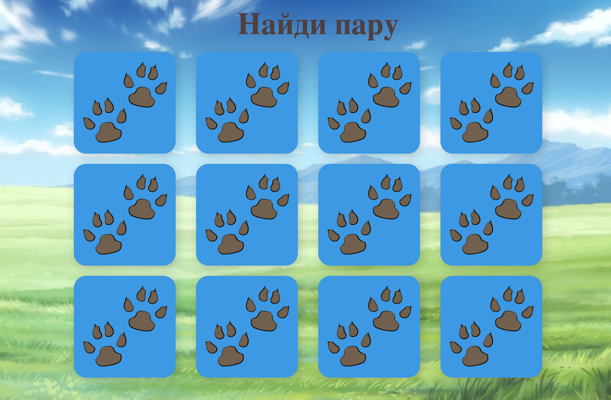

### Игра "Найди пару"

Игрок видит квадратное поле из карточек, расположенных рубашкой вверх, и находит пары, открывая карточки в произвольном порядке. На открытых карточках расположены картинки собачек. Игрок открывает сначала одну карточку, затем вторую. Если открытые карточки одинаковы, они остаются открытыми до конца партии. В противном случае они переворачиваются обратно.

